# (某码农的不科学)投机市场观察录 
## [2022-11-9] [市场观察] 回顾今年出现的两次盈亏比极佳的投机机会
( 1 ) 马斯克收购推特是一个概率事件, 收购成功前夕, <br>
鉴于马斯克和DOGE的暧昧关系,传递出打赏支付和web3的叙事,<br>
那几天在支撑点位置的DOGE,是一个很好的标的.<br>
(指的是当时的短期一波流, 目前已经price in, 不要再冲啦,币圈一天人间一年)
<br>

( 2 ) ETH升级到POS机制那几天,炒作ETC承接ETH算力的叙事.<br>
(指的是当时的短期一波流, 目前已经price in, 不要再冲啦,币圈一天人间一年)
<br><br>


## [2022-11-9] [市场观察] 最近几个比较标志性的事情
###### ( 1 ) 联储公开摊牌, 通胀指标不是停止加息的依据.

<br>

###### ( 2 ) 硅谷科技公司裁员风暴, 熊市里程碑.

<br>

<br>

###### ( 3 ) 交易所流动性危机
FTX大战Binance,深度熊市的固定戏码

<br>

<br>

<br><br>

## [2022-10-24] [市场观察] 历次经济金融危机手册(转载)
来自:微信jinrongjianghu123123<br>
<br>
<br>

## [2022-9-19] [市场观察] 复盘与展望
#### 两年行情回顾, 原则的积累, 韭菜的自我修养总结
>  ( 1 ) 均值回归<br>
( 2 ) 押注大概率事件获利<br>
 ( 3 ) 拉长时间维度确认概率<br>
 ( 4 ) 宏观周期碾压中期趋势/短期波动<br>
 ( 5 ) 场外收入的必要性<br>
 ( 6 ) 稀缺与准致富状态<br>
 ( 7 ) 建立框架<br>
 ( 8 ) 致力于长期事业<br>
 ( 9 ) 接受短期浮亏状态<br>
 ( 10 ) 持强凌弱,欺软怕硬<br>
 ( 11 ) 减少频次的意义<br>
 ( 12) 时间安全边际/空间安全边际<br>

<br>

##### 1 均值回归
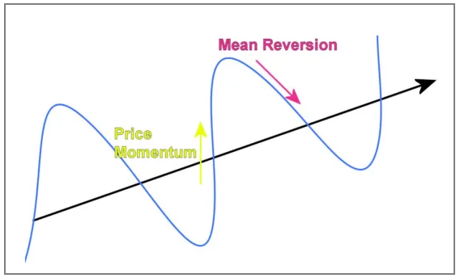<br>

例子:<br>
 ( 1 ) 一支股票的价格短期发生剧烈波动,如快速拉升到历史高位,<br>
但长期来看, 其价格一定会贴近于它的价值中枢位置.<br><br>
( 2 ) 父母两人智商处于人群的前3%甚至是前1%,<br>
在80%到90%的情况下, 其后代达不到两人的水平, 会比他们要差.<br><br>
( 3 ) 手机等移动设备出货量经过多年的高速增长后开始下降,<br>
中国GDP经过多年的高速增长后开始放缓,遇到一些短期无法克服的难题.<br>
(不是崩溃了,只是以前太顺太好,之后回归正常).<br><br><br>

均值回归的意义<br>
( 1 ) 经过对标的物的长期观察, 对本质建立深度的认识后, 明确其真实价值中枢位置, 确认其低谷、高光时期.<br>
( 2 ) 如何寻找价值中枢? 归纳法, 演绎, 第一性原理.<br><br><br>
归纳法: <br>
(a)昨天太阳从东方升起, <br>
今天太阳从东方升起, <br>
所以明天太阳也从东方升起. <br><br>
(b)某商品价格第1次突破历史高点后的一年里,价格崩盘下跌了90%.<br>
某商品价格第2次突破历史高点后的一年里,价格崩盘又下跌了90%.<br>
今年是它第3次突破历史高点的后一年,所以它今年价格也会跌80% 90%.<br><br>
归纳法可以得出概率性趋势,而不是必然性知识,且样本数要足够大.<br>
这也导致它的局限,不具备连续性.(无法确保未来和过去一样)<br>
现实生活是非连续性的,我们最后所有的重大问题全部因为这个悖论而产生重大的灾难.<br>
因为大脑有先天的结构性缺陷,最小作用力原则,为了节省大脑运算空间.人类大脑只能假设未来不会变化.<br><br>
演绎法:<br>
(a)所有人都会死,<br>
苏格拉底是人,<br>
所以苏格拉底也会死.<br><br>
(b)今年美联储会收紧流动性<br>
交易市场中的现金收缩会导致资产价格下跌,<br>
某商品X是交易市场中的比较流行的资产,所以商品X资产价格也会发生下跌.<br><br>
演绎即从已被证明的公理中出发,去推出新的道理.<br>
演绎法如果前提正确,那么结论一定正确.<br><br>
第一性:<br>
"所有人都会死","今年美联储会收紧流动性",这种前提是演绎的起点,就是所谓的第一性,<br>
是一个最基本的命题或假设,不能被省略或删除.<br><br>
问题是, 你凭什么相信你的道理必然为真?<br>
像巴菲特不投科技一样,<br>
在投机投资这件事上,<br>
有时是种价值观问题,<br>
你无法让所有人相信什么是正确的.<br>
<br><br>

##### 2 通过押注大概率事件获利
首先确定哪些是小概率事件?<br>
(1) 买中双色球一等奖(概率0.0000056%)<br>
(2) 飞机失事空难(概率0.000015%)<br>
(3) 美国新公司从创业发展到上市敲钟的平均比率(概率0.0006%)<br>
(4) 在交易市场分钟级别行情, 持续滚仓获利 (滚仓次数越多,获利概率越小,归零概率越大)<br>
(5) 立志成本职业电竞选手,头牌主播,常年在投机市场撸短线养家,<br>
开一家创业公司一步一步做大做强,这些都是概率极低的事情,<br>
每一个都是万里挑一的人杰,实力和气运缺一不行,<br>
对普通人来说不具备太多可复制性.<br><br><br>
另一方面有哪些常见大概率事件?<br>
(1) 北京的早上八点会天亮.<br>
(2) 地球北半球夏天的平均气温高于冬天.<br>
(3) 巴西队在世界杯小组赛中战胜中国队.<br>
(4) 1995-2015年,普通人选择计算机行业的性价比普遍高于生化环材<br>
即使在行业里混的很差大概率是可以赚点小钱<br>
不至于像其他行业一群985毕业生争夺一个月薪不到1w的工作机会.<br>

意义?<br>
( 1 ) 区分出哪些机会是大概率事件? 哪些行情是小概率事件? 认识到哪些行情可以重仓做甚至all in? 哪些几乎不能做?<br>
( 2 ) 完成初阶排雷, 彻底打消那种低级的普遍的幻想: 只押注一支冷门小标的,然后翻十倍暴富.<br>
( 3 ) 如果赌明天早上八点北京会天亮就可以赚钱,没有多少人会不心动吧?<br>
听起来有些不可思议,但事实上在交易市场中, 每1~2年都会偶尔出现这种盈亏比绝佳的送分题机会.<br>
( 4 ) 你展开市场行情演绎的那个大前提, 不能说必须100%正确, 但起码是一个大概率会发生的事情.<br><br><br>
大概率事件获利的典型案例<br>
( 1 ) 2017年夏天, 虚拟货币ICO概念出现, 市场中群魔乱舞乱象频出, 在ICO发展火热中期, 某网友预判到GOV必然会在未来几个月做出监管动作整治炒作乱象, 故提前从市场中脱身离场.
后面监管如期而至9.4发生, 币圈海啸,千币齐跌, 和ICO毫无关系的冰糖橙同样被牵连暴跌.<br>
此刻, 作为币圈老混子的某网友, 基于对冰糖橙的深度认识, 意识到只是对冰糖橙的波及引发的超卖, 故全仓all in btc, 后面的事情大家也熟悉了,那一年冰糖橙波澜壮阔的狂暴牛市.<br>
这其中有两个大概率事件, <br>
其一, ICO乱象必然引发监管出击.<br>
其二, 对冰糖橙价值中枢的认识, ICO监管波及其价格引发超跌, 但彼时其长期趋势无人可以逆转.<br><br>
( 2 ) 通胀指标走坏, 为打压通胀2021年开始全球信贷货币普遍收紧,<br>
用资产价格崩盘/牺牲就业率/甚至动态清零防控的方式打压通胀, <br>
资产价格崩盘是大概率事件, <br>
在2021开始就注定了,<br>
所有的中短期交易行为,商业投资行为,职业职位的更换,<br>
都绕不开这个最强的外部权重.<br>
躲过下跌意味着锁定机会成本, 意味着进入"准致富状态",<br>
在未来在真正转向的复苏时期(价格自底向上时期)有更多筹码扩大获利. <br><br>

( 3 ) 兔鹰脱钩 兔鹰之争<br>
有时候感觉国际环境和混黑社会一样,<br>
兔子加入WTO跟老鹰大哥混, <br>
接手一些低端的杂活干,跟着大哥喝口汤,<br>
现在兔子腰板硬了,想抢大哥的高端利润生意和场子,<br>
兔子要起势,老鹰试图按住兔头,<br>
其他外资开始站队,有的撤资跑路有的一起揭竿而起,<br>
18毛衣是前奏,22坐飞机去宝岛观光是前奏,<br>
未来兔子这边大概率会发生跟熊和二毛一样的形势,<br>
虽然不至于全面开打,但通过局部斗争拖住兔子的发展势头,争取时间重新领先是可以的,<br>
这种利益冲突的矛盾长期来看无解,<br>
**这里放下主观立场,我们只确定一件事,兔子拖进坑里过一阵苦日子,是大概率事件.**<br><br>

基于上述对未来的一些预期和演绎:<br>
( 1 ) 两强对抗是主旋律.<br>
( 2 ) 货币工具可武器化用于对抗.<br>
( 3 ) 历史上真实发生过这样的事,"放弃经济和就业指标将两强对抗作为最高优先级."<br>
所以美联储利率转向的的依据不仅是CPI和就业指标,可能是两强对抗的进度条.<br>
货币工具箱将服务主旋律,可能CPI就业指标都被优化美化,从宏观数据上给加息争取理由和空间.<br>
CPI回暖不等于转向,实际利率会长期维持高位,不要去交易转向,不要赌美股拐点, 空单 > 看空 > 多单<br>
( 4 ) 周期上放空大饼没有疑问, 但不要在历史极限支撑位置做空大饼,风险收益不对等.<br>
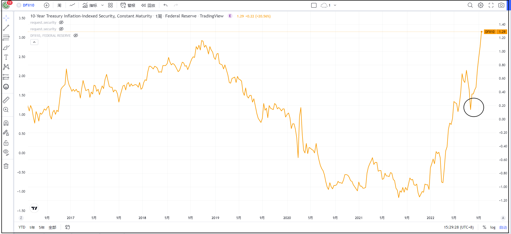
<br>

再具体一点:<br>
从现金流量贴现的角度看, 高利率等于极高的借钱成本, 投资人直接存起来享受很高的无风险收益比拿去投资要香的多, 所以市场漂泊的资金会变少, 投资会变少工作机会会变少. 资金偏好从低利率时期的讲故事理想讲PPT讲估值, 转向为追求能稳定创造收益的价值类型, 新兴市场不确定性因素增加, 外资逐步从新兴市场撤退, 过去一年我们已经看到了中概股票RMB港股台股台币被price in. 甚至由于两强对抗的缘故, 以后复苏时期, 一部分外资的去向, 可能都会不再倾向兔子的科技行业(防止再出个Huawei和TikTok), 对互联网来说, 就是投资收紧/撤出, 创业公司变少, 大公司内创业团队变少, 内斗裁员的状态最少维持至利率转向. <br>
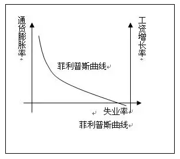<br>


<br><br><br>

##### 3 拉长时间维度确认概率
提高概率最简单奏效的办法是拉长时间维度.<br>
连续预测后一天上午的温度不可思议,<br>
连续预测分钟级别的行情价格是天方夜谭.<br>
但预测下个季度的平均气温轻而易举,<br>
预测月线级别的价格趋势难度也大大降低.<br>
修仙小说中,一些老怪物蛰伏地下百年等待天时人和,只为破道飞升那一天.<br>
市场上同样有这么一群人,五年十年的狙击一个进阶的机会.<br>
<br><br>

##### 4 宏观周期碾压中期趋势 / 短期波动
在修仙小说中, 会经常看到"宗门弟子的内斗" "气修与剑修体修之争" <br>
"宗门之争"  "末法时代到来灵气枯竭" "域外天魔降临天地崩塌"之类的情节.<br>
<br>
小说中主角所在宗门, 如果在未来几年将与其他宗门发生冲突被灭门, <br>
那当前他在门内与其他弟子,<br>
争亲传名额 争内门外门名额 打个天昏地暗,<br>
一时的输赢也不会改变被灭门的结果.<br>
<br>
继续把级别放大,两个宗门经过长时间的斗争,其中一个终于吞并了对方的宗门,<br>
但是突然间域外天魔来袭,整个大陆的灵气被抽干不再适合修炼,所有人只能等死,<br>
门里的内斗,门外的宗门之战是不是显的没什么意义?<br>
<br>
在K线中是这样, 分钟级别的博弈将被中期趋势打破, <br>
而中期趋势向月线年线级别的周期规律投降. <br><br>

2021年开始联储货币收缩的主旋律下,<br>
还在考虑梭哈做多哪个标的可以捞一笔,<br>
在90%的人亏损的环境下做多是一厢情愿的,<br>
对那些估值类型的shitcoin和科技个股做基本面分析也是徒劳.<br><br>

周期的意义:<br>
- 所有的中短期抉择与危机,有更外围的宏观框架做指导,都可以避免过度内耗和不必要的纠缠<br>
.在市场中,当意识到外部的宏观变化,情绪不会再受眼下分钟级别k线的影响.<br><br>
- 在2007年,你看着乔布斯站在iphone发布舞台上意气风发,<br>
那一刻你意识到了一个新的移动设备周期大概率被开启, <br>
你虽然无法预测是谁这场秀的大赢家,无法压中一只独角兽(阿尔法),<br>
但果断你买入了芯片与移动互联的ETF,<br>
并且肉身投入到移动互联的行业中, <br>
多年以后同样享受了远超其他产业的移动行业平均收益(贝塔).<br><br>

- 同样的周期一遍又一遍在重复, <br>
看到人工智能是未来的人买入了英伟达AMD为首的ETF, <br>
看好兔子国运的人投入新能源ETF,<br>
坚信货币互联网和WEB3是未来的人持有BTC/ALTCOIN ETF,<br>
传奇交易者们看清了欧洲去工业化早早开始了空欧洲做多能源.<br>
地球上没有统一的普世价值,没人能证明对方的第一性和价值观是错的,<br>
每一个长期主义都因自己的价值观获利或买单.<br><br><br>

##### 5 场外收入的必要性
均值回归可以找到低价区间, 但无法找到最低点, 通过控仓定投或源源不断的场外输血, <br>
可以得到一个低价区间的均价, 投资投机市场的寿星都有无限子弹的特点, <br>
道理很简单,但是做起来很难, <br>
一方面持续稳定的现金流收入可以淘汰一批人, <br>
一方面熊市别说买入了, 都没有人愿意关注行情, 时间长了都会自我怀疑, 趋利避害人性使然.<br>
<br><br><br>

##### 6 稀缺与准致富状态
曾经从一本书上看到的说法, 觉得很好: <br>
在长期性的资源(钱、时间)稀缺中，人们已经形成了“管窥”之见, <br>
只能看到“管子”之中的事物，虽然这有可能为我们带来“专注红利”(短期的富裕或效率),<br>
但是从长远来看，这种“专心致志”反而会让我们产生“权衡式思维”，不断增加我们的带宽负担. <br>
---- <<稀缺>><br>
<br>
简单说,<br>
忙于生计的人, <br>
没有心力去顾及真正对自己长期有意的事情, <br>
短期生存目标给长期目标让步是常态. <br>
<br>
贫穷状态和致富状态两种状态, 很难完成直接转换, <br>
必须先摆脱稀缺, 把自己拉到一个不缺时间不愁眼下的"准致富状态", <br>
处于这种中间状态, 我们不再为眼下妥协, 着眼那些真正对自己长期有事情, <br>
可以增加转换为致富状态的概率. <br>
<br>
忙于生计 ----> 准致富状态 ----> 致富
<br><br><br>


##### 7 建立框架
为了在互联网和投机倒把的圈子里活下来,我做过最有用的事情是建立自己的生存框架,<br>
比如我经常给自己强调灌输的那些概率 我很平庸并不出众 可复制性之类的东西.<br>
如果没有这些框架, 每天在互联网/期货市场/币圈暴富传说洗礼下,<br>
正常人要么情绪崩溃,要么变得穷凶极恶,几轮下来就要被洗出局.<br>
<br>
你先别管框架里的东西对不对,总之先得有,慢慢完善框架,<br>
把自己搞自洽了,并且坚信不疑,才能防御全开,<br>
不被别人忽悠瘸了,保持一个稳定的情绪状态.<br><br><br>

##### 8 致力于长期事业
长期观察市场,提高风险识别,挖掘机遇没有疑问, <br>
但是最好不要专门从事投资或投机的这一个事业, <br>
当我们挖掘到一个盈亏比3:1或者更佳的机会时,场外无风险收益可能更加重要, <br>
100w\*2和1000w\*2的风险是一样的,投机和投资不具备造血能力,它更多的充当助推器和加速剂. <br>
从观察上来看也是这样,高手多数都有自己的长期事业,情绪稳定专注生活多于专注市场, <br>
(我身边就有这样的狠人,专注于事业和家庭,情绪异常稳定,不计短期得失,看准机会后出手果断) <br>
距众所周知的例子的话, 比较典型的, 像雷军这样的顶尖投资人, 也有自己的小米事业, <br>
再有就是专门做中介抽水职业来造血的那一类职业. <br><br><br>

##### 9 接受短期浮亏状态
市场中至少90%的时间处于高点以下的状态, <br>
泡沫时期出货窗口不到10%, <br>
所以即便在低谷区间买入持有,  <br>
短期大概率也是会再跌的, <br>
长期玩家参与市场必须做好心理准备,接受这种状态. <br><br><br>

##### 10 持强凌弱,欺软怕硬
动物世界的主旋律是欺软怕硬, 吃掉比自己弱小的物种, 避免和天敌克星相遇.<br>
人类社会的主旋律是持强凌弱, 我退一步对方就向前迈一步, 我方强势对方就弱势.<br>
投机市场是类似的强势筹码打压弱势筹码, 血洗存在持有压力的资金, 存在借条和利息的资金, 带杠杆的钱天然弱势.<br><br><br>

##### 11 减少频次的意义
待续<br><br><br>

##### 12 时间安全边际/空间安全边际
待续<br><br><br>

## [2022-8-28] [市场观察] 美股将进入主要下跌阶段
如果美联储利率转向的的依据不仅是CPI和就业指标,而是两强对抗的进度条,<br>
那么参考70-80年和2000年, 美股的下跌目前还没有结束.<br>
这对不做衍生市场的人也有重大意义,<br>
逃离市场意味着锁定机会成本, <br>
在未来在真正转向的复苏时期有更多筹码扩大获利, <br>
进入"准致富通道".<br>
<br><br><br>

## [2022-7-20] [市场观察] 对村镇银行违约与停贷断供的一些想法
- 地方银行违约与房贷断供看起来和局外人没有直接关系,<br>
但其中可以挖掘出一个多数人相关的长期风险.<br>
<br>

- 地产繁荣时期的常态<br>
大部分普通人没有大额储蓄,<br>
因为直接都被地产黑洞吸收了,<br>
未来二三十年也不会有.<br>
<br>

- 增值焦虑<br>
房价普跌背景下,<br>
"立刻买房"不再是必选项,<br>
而那些暂时避开了楼市深坑的普通人,<br>
即便深度厌恶着高风险的投机市场,<br>
也仍然面临着一个隐蔽的长期风险 ---- 增值焦虑<br>
<br>

- 人群特点<br>
通过多年劳动积累了一定数量的现金,<br>
长期受通胀环境与增值焦虑困扰,<br>
但资金和风险管理能力没有随账目金额同步成长,<br>
没有建立有效的信息获取渠道,<br>
缺乏对环境变化的敏感性,无条件信任银行的专业人士.<br>
<br>

- 焦虑的源头<br>
外部是通胀环境,<br>
内在是资金和风险管理能力没有随账目金额同步成长.<br>
<br>

- 解决之道<br>
(1)意识到个人能力边界,<br>
如果此生无法再成长半步,<br>
就将长期目标从增长转换为守业,<br>
主动降低预期,控制焦虑情绪.<br>
(跟自己和解是一件很难的事情,没有多少人愿意承认自己很平庸,接收自己是傻逼的设定)<br>
. <br>
(2)在财务与风险管理方面下功夫,<br>
投入相当的时间和精力在这之上,<br>
意识到1万 10万 100万,<br>
每个阶段需要不同的玩法和能力.<br>
. <br>
(3)让能力匹配的上欲望<br>
有着清醒的自我认识,<br>
不做能力边界以外的事情,<br>
不追逐能力边界之外的物品.<br>
(灾难的开端通常都是欲望和能力不匹配)<br>
. <br>
比如:<br>
靠短期预测和高杠杆在投机市场暂时撸到钱,后期普遍会又输回去,因为"预测"与"杠杆"是普遍无法掌控的能力,它们并不受控,人们追逐能力边界以外回报,求而不得,所以焦虑痛苦.<br>
. <br>
一个男性各方面条件都不是很好,即使暂时骗到一个高出他level的女人做老婆,后期女方大概率也会发现她在市场上可以匹配到更好的人选,觉得自己估值偏低了,发展出矛盾,以一种"均值回归"的过程结束.<br>
<br>

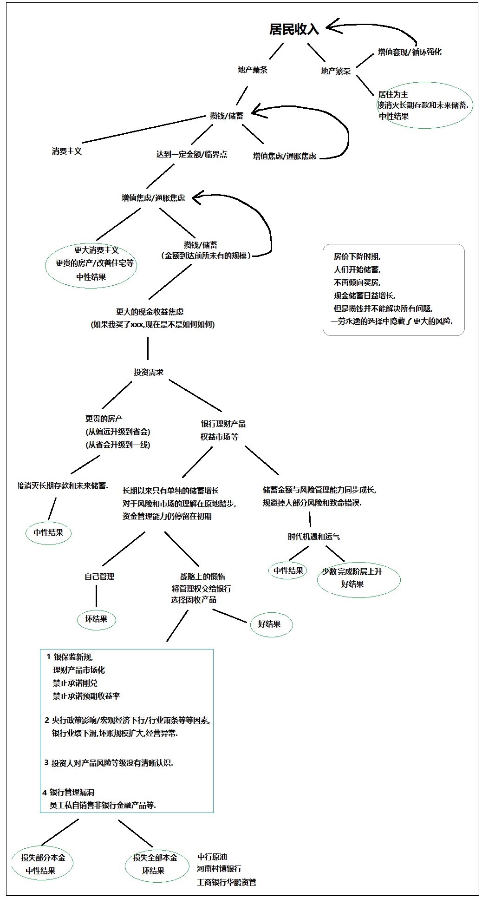
<br>

###### 注:
###### 在2018出台的银保监理财管理办法中明确了两点
1 禁止商业银行承诺理财产品的保本收益和刚性兑付.<br>
2 禁止商业银行宣传理财产品的预期收益率.<br>
<br>

###### 猜测银保监禁止保本刚兑的动机是什么?<br>
- 经济下行时期(尤其地产相关),普通银行在市场中也无法做到100%赚到钱,<br>
如果收益不达标,刚兑意味着银行要自掏腰包支付客户的收益.<br>
长期垫付收益,会导致机构的坏账率上升,积累更大的连锁危机,银行被压垮,引发系统性风险.(危机到来大家一起死)<br>
打破刚兑,将风险转移给每个客户,就可以防止积累系统性风险.(危机到来牺牲少部分人.)
<br>

- 做顶层设计的人已经预判了经济下行带来的连锁反应,<br>
预判到了地产拐点发生后,银行坏账规模的扩大,投资亏损概率的上升<br>
(因为房地产是资金主要流向,地产不景气银行的投资也亏本)<br>
所以调整政策,提前将风险转移给了每个个体.<br>
<br>

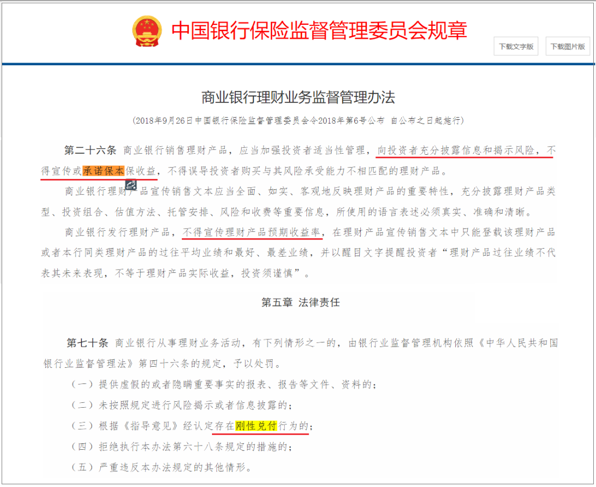
<br>

## [2022-5-25] [交易系统] 冰糖橙定投简易指标
#### 指标1：彩虹图
从绿色系(BUY)开始向下,是比较好的买入时机,而到黄色(HODL)开始以上就不要加仓了.<br>
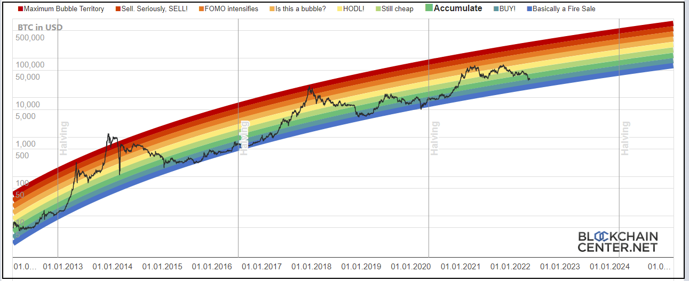

#### 指标2：AHR999
ahr999数值介于1.2和0.45之间是比较好的买入时机,并且越小越好.<br>
0.45常常是历史上极佳的买点.如果你喜欢加杠杆,耐心等待0.45的附近是一个比较稳妥的选择.<br>
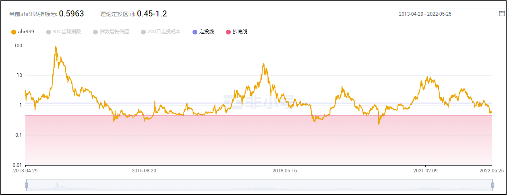

#### 指标3：美元实际利率
在美元实际利率大幅度上升的阶段，常常伴随着资产价格暴跌，<br>
所以在它上升的这一年半载，最好什么都不做，或者开空也行，最起码不要加仓做多。<br>
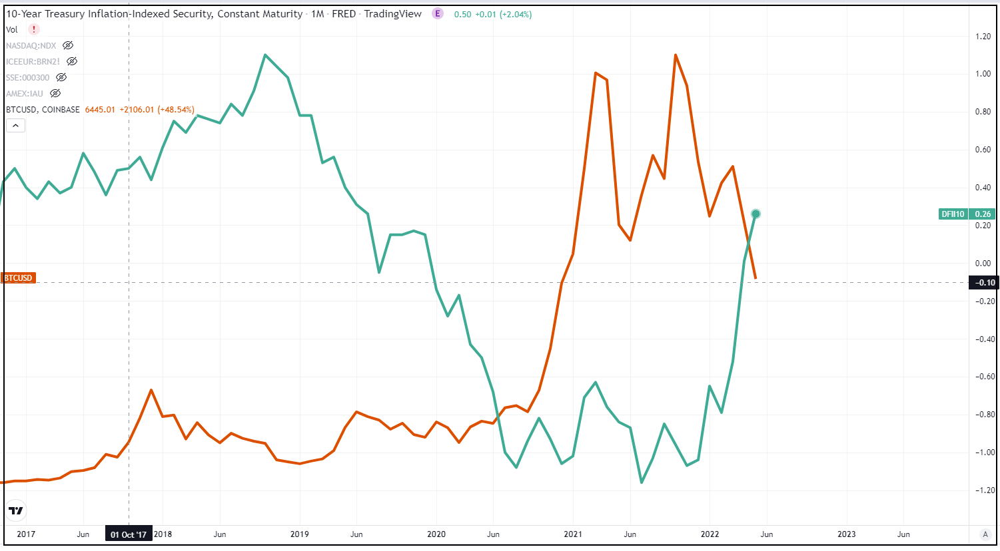

#### 指标4：减半节点与S2F估值模型
S2F是冰糖橙比较常见估值模型，<br>
它指出了冰糖橙的长期价格走向，<br>
S2F的显著特点是,<br>
显示每次减半节点过后,<br>
冰糖橙价格会攀升的水平位置,<br>
下一次减半时间为2024.4.13,<br>
对长期交易者来说建仓截至到此,<br>
对短期交易者来说在这以后减少做空。<br>
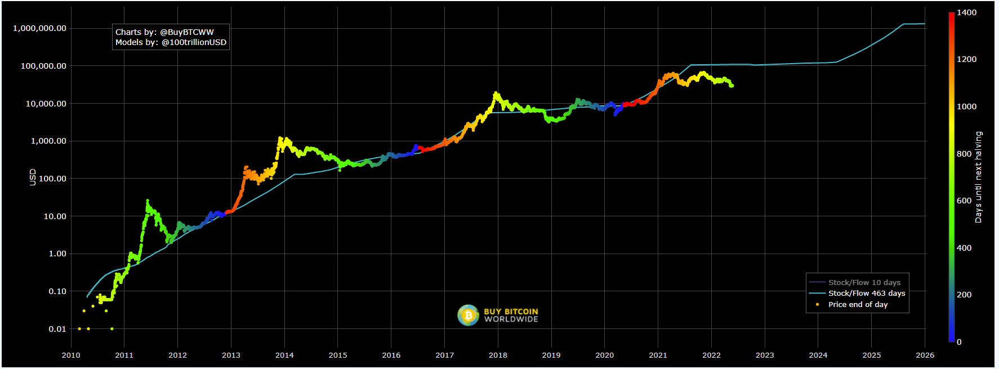

#### 指标5:  Days from ATH
叠加几轮周期高点后的价格表现,来观测市场目前大致处于哪个阶段<br>
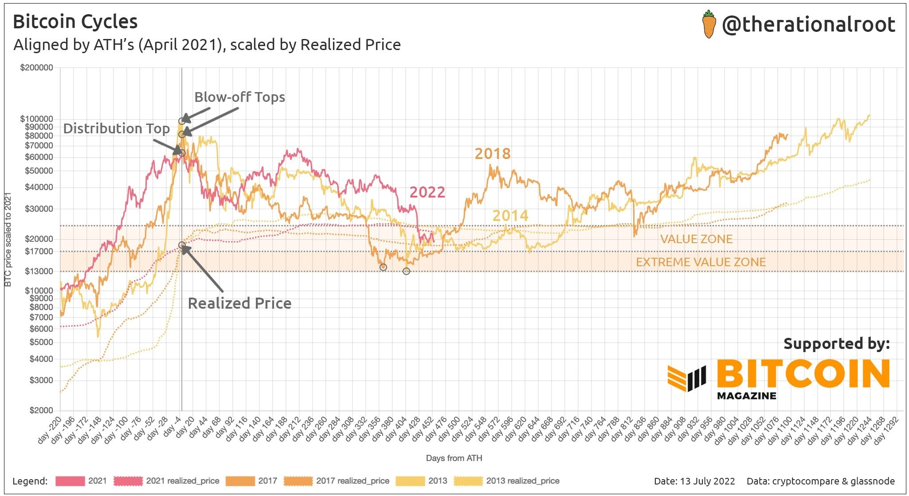
<br>
历史上看,底部出现的间隔天数,都具有一定的周期性和规律性(1000~1200)
<br>

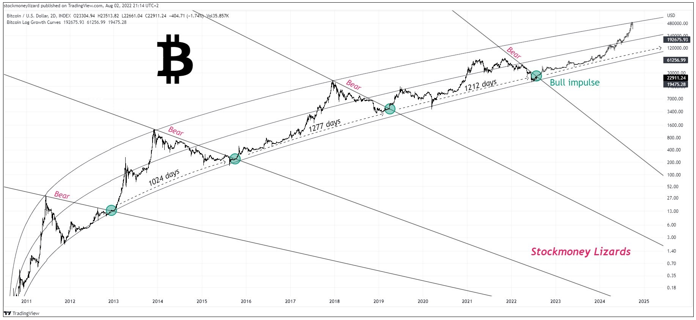

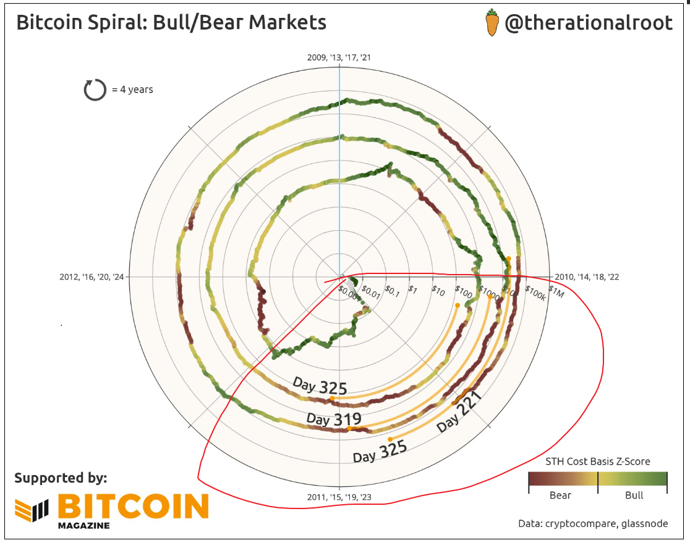


参考：<br>
[彩虹图](https://www.blockchaincenter.net/en/bitcoin-rainbow-chart/)<br>
[ARH999](https://www.fxhapp.com/data/ahrdata.html)<br>
[实际利率](https://fred.stlouisfed.org/series/DFII10)<br>
[S2F](https://stats.buybitcoinworldwide.com/stock-to-flow/)<br>
<br>

## [2022-5-23] [市场观察] <<经济回报、利率、汇率、资产和负债 价值和估值>>
###### 原文：<br>
[wechat: 经济回报、利率、汇率、资产和负债 价值和估值](https://mp.weixin.qq.com/s/fs-wMetDFe5HmCl3f8tztA)<br>
[备份：经济回报、利率、汇率、资产和负债 价值和估值](./data/readme/2022-5-23-1.7z)<br>
###### 阅读大咖长文后的资料整理,内容涉及全球资本流动模型、中国近几年市场表现<br><br>
###### 情况1<br>
美联储加息阶段, A国增长>美国增长<br>

<br><br>

###### 情况2<br>
美联储加息阶段, A国增长<美国增长<br>

<br><br>

###### 情况3<br>
美联储加息阶段, A国经济下行<br>
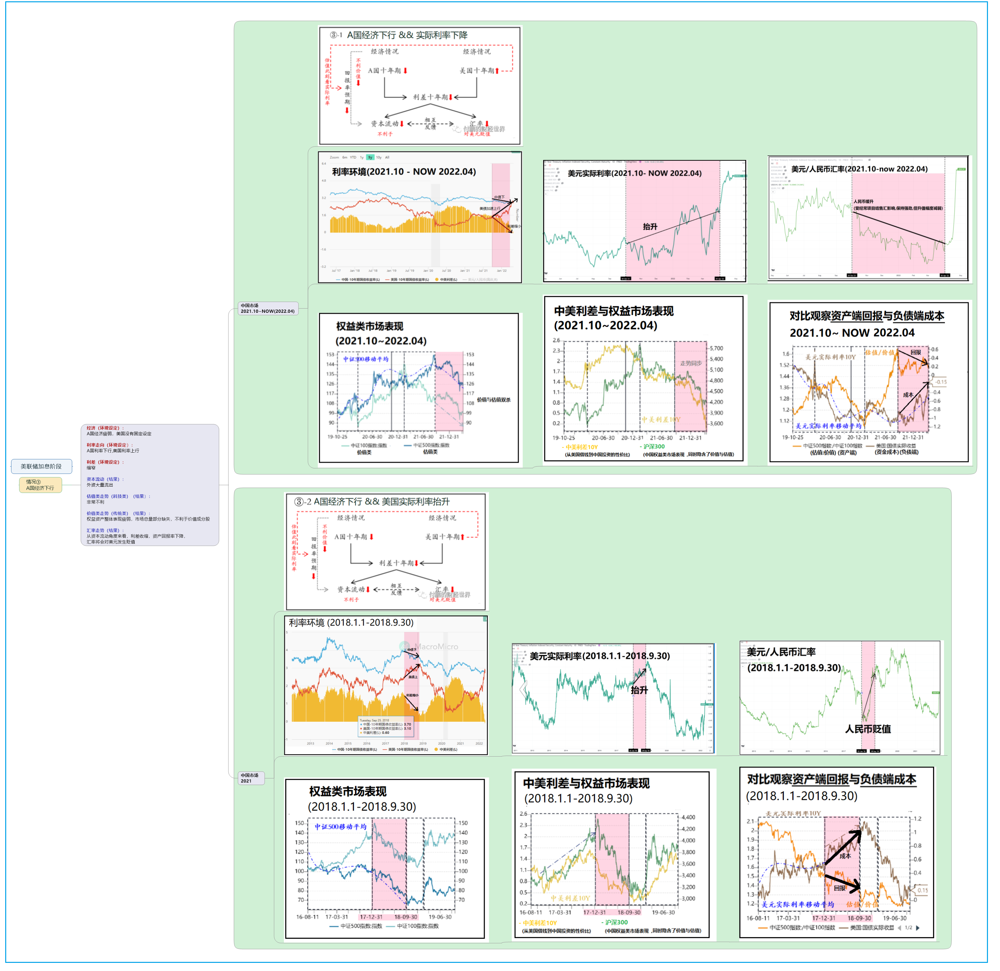
<br><br>

###### 情况4<br>
美联储处降息阶段, A国大衰退, 美国小衰退<br>
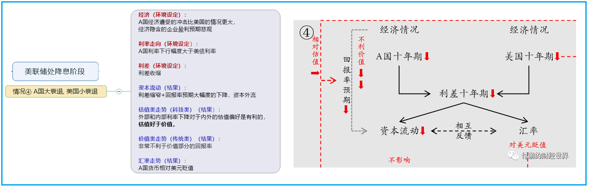
<br><br>

###### 情况5<br>
美联储处降息阶段, A国小衰退, 美国大衰退<br>
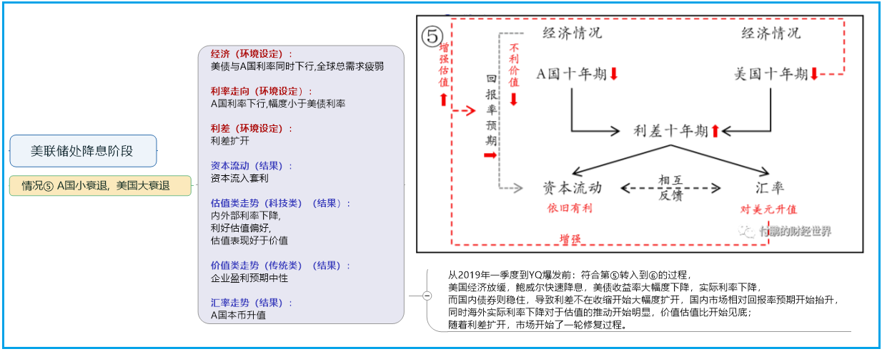
<br><br>

###### 情况6<br>
美联储处降息阶段, A国增长，美国衰退<br>
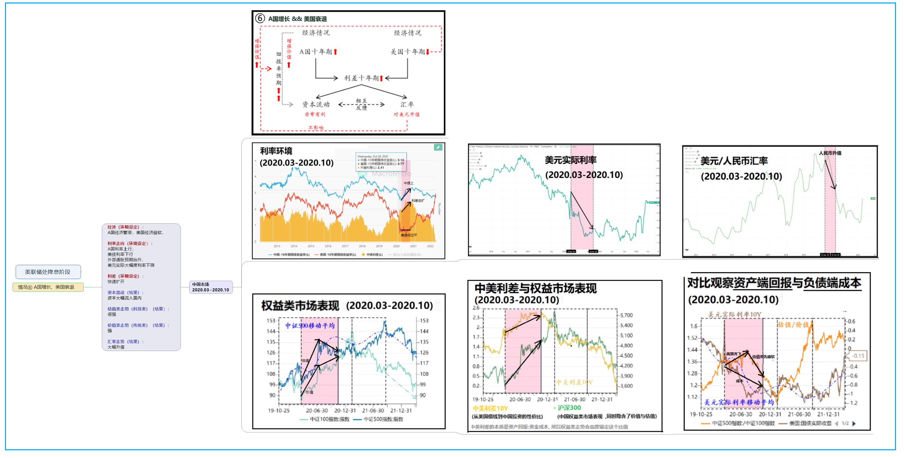
<br><br>

##### 资本流动关键
```java
国债收益率 ≈ 市场中的无风险收益率 ≈ 名义利率

利率的主导者：外部：美联储，内部：本国央行，手段：公开市场操作等

利率的传导性：信用越低的借贷方，给出的借贷利率越高，才能借到钱。

利差 == 两个国家的利率之差 == 套利机会（从A国借钱，到B国放贷，无风险的赚钱机会，引导资金流动的关键）

负债端成本 == 借钱成本 == 资金成本 ≈ 美元实际利率 

利率影响资产价格的理论解释 == 现金流贴现法

利率对资金风险偏好的影响：加息时偏好价值类 谈现实，降息时偏好估值类 谈理想。
```
<br><br>

## [2022-4-22] [市场观察] 从负债端看资产回报率
#### 观点来自东北证券-付鹏

<br><br>

#### 全球主要货币信贷增速 <--> PPIRM、MSCI全球股指

<br><br>

#### 流动性视角,解读中美利差的本质
```java
1 中债理解成投机标的，即资产回报。
2 美债收益率理解成名义利率，借钱去其他投机市场炒作的成本，即负债端。
3 从这个资产负债的视角来看，中美利差的本质，即资产回报:负债端成本 (理解成两者比值)
4 如此就可解释，为什么投机市场走势、各市场指数，会高度关联或者说锚定中美利差。
```
<br>

<br><br>

#### 流动性视角,解读长短期美债收益率倒挂的本质
```java
在2016年以后，
长端美债代表全球(包括中国 欧洲在内国家,弱势的经济增长和回报)
短端美债代表美国(仅仅代表当前强势复苏的美国)
所以长短端美债倒挂和中美利差倒挂，性质上是一回事，
美国可以承受强势加息，在加息中复苏，而其他国家承压放缓增长。
反映在资产上是新兴国家股市崩溃，反映在汇率上是新兴市场国家货币大幅度贬值。
```

<br><br>

## [2022-3-22] [市场观察] 为什么加密原住民在这一轮周期要重点观察美股？
因为加密市场参与者的结构发生了变化,<br>
和以往的参与者类型不同，<br>
这一轮涌入了大批的美股大玩家(同时还驱逐了大量的中国散户)，<br>
美股玩家会用他们的逻辑给大饼定价，<br>
他们的交易习惯和资金使用特点，<br>
会深刻的影响大饼的中短期走势。<br>
(进而影响左侧人群的抄底时机)<br>
<br>
**参考：科技股特斯拉走势vs大饼走势** <br>
  
<br>
**为什么呈现出美股化的趋势？**<br>
我理解，美股玩家用他们"现金流贴现法"类似的习惯给大饼定价(**贴现率的变化会引起大饼价格波动**),把大饼当成一种科技股来买卖,并且通过他们近两年低廉的资金成本(一系列放水所致)，暂时掌控了定价。
<br><br>
**我们关心什么？**<br>
如果之前大饼和特斯拉走势相似，那缩表+加息的牌全部打出，<br>
按照现金流贴现的逻辑科技股跌，大饼跟着一起跌吗？<br>
在一两年之间，还能继续刻舟求剑吗？走出自己以往的节奏吗？<br>
<br><br>

## [2022-3-22] [市场观察] 经济衰退红灯，长短期美国国债收益率即将倒挂
  
<br>

**正常情况**：时间越长利息越高  
十年期美债收益率 > 两年期美债收益率
<br>

**异常情况**：("美债收益率倒挂"现象)  
十年期美债收益率 < 两年期美债收益率
<br>

**差值**：  
差值=十年收益率-两年收益率  
差值<0时，常常是美国经济衰退时期.
<br>

**划重点**：<br>
我们关心什么？<br>
更多的是,市场大概处于一个什么位置,一个大致的拐点区间.<br>
类似巴菲特之类的老油条最擅长,手握天量现金，平常没有多余的动作，等崩溃时来一发.<br>
(三五年内就那么一次好机会,最多能精确到某年上半年还是下半年的样子,能从2021憋到现在,其实也能超过很多人了)<br>
<br><br>

## [2022-3-15] [市场观察] 中概互联的价值重估
(不局限于中概互联，范围扩展可能是所有中国核心资产)  
(1)第一层BUFF：美元流动性收紧,引发的估值泡沫破裂  
(2)第二层BUFF：互联网产业周期寡头阶段行情  
(3)第三层BUFF：反垄断、共同富裕目标、互联网基础设施公共服务化趋势  
(4)第四层BUFF：逆全球化趋势,中美重演俄乌金融封锁的预期,引发外资不计成本的抛售中国资产  

第一层BUFF：美元流动性收紧,引发的估值泡沫破裂  
根据美元指数和港股指数负相关的常识，对比它们的趋势可以显而易见的观察到流动性的变化。  
  
(美元指数vs港股大盘)  
<br>
中丐互联科技公司的股价几乎都是2020 3月吹泡泡吹起来的。  
  
(美元指数vs中概互联指数基金)  
<br>
第二层BUFF：互联网产业周期寡头阶段行情  
参考工业革命成熟期的走势  
  
<br>
第三层BUFF：反垄断、共同富裕目标、互联网基础设施公共服务化趋势,重塑估值方式  
"如果只是一个政策的冲击，  
你冲击的可能是对盈利的判断，  
但这个还都在正常的逻辑下，  
但是如果你的整个商业模式都发生重大的变化了，  
那你可能甚至是说，  
整个商业模式在中国的政策目标里未来都转向一个公共服务类，  
甚至带有一定这个这个公益性质的行业的话，  
那这可不是一个简单的光盈利预期下修的问题."  ----来自付总  
<br>
第四层BUFF：逆全球化趋势,中美重演俄乌金融封锁的预期,引发外资不计成本的抛售中国资产  
  
为什么在2022年3月这个时间点通过"中概下市法案"？  
猜测：为了驱赶欧洲资本逃出欧洲，同时不能流向中国，保障回流到美国国内。
<br><br>

## [2022-3-15] [市场观察] 回忆312币圈纪念日  
以下是312暴跌的逻辑和发生经过（按照时间顺序和逻辑关系如下):  
疫情、全球股市、经济危机、流动性恐慌等宏观情绪传染到币圈，引发2月中旬到3月上旬的下跌调整。   
减半一致性预期被击溃，且比特币避险属性共识开始瓦解，市场负预期严重。   
<br>
巨鲸出货卖盘增加。 引发下跌进一步下跌。  
投机客、资管量化、苦命的矿工多头杠杆（包括借贷平台、场内杠杆现货、Defi去中心化借贷）自我叠加式爆仓，  
价格快速进入自我加强的下跌 价格下跌如此之快，  
乃至BitMEX上的套利党爆仓导致互相踩踏，  
进一步加速下跌，价格如同自由落体一般。  
<br>
Btc拥堵充值不进去、搬砖口子小引发的USDT溢价过高一起共同导致了场外入金严重不足。  
场外入金难以抵挡场内的爆仓螺旋，价格颓势难以抵挡。   
Maker的eth抛压，造成了价格进一步下跌。  
并且，赎回dai进一步造成了流动性枯竭。   
<br>
圈外空军见到这个情况，如同嗅到了猎物，也加入做空行列，价格接着下探。  
直至Bitmex拔了网线，市场上的最大卖盘瞬间停止，场外流动性开始跟上，  
且Bitmex用自己的保险金吃爆仓单，一下子稳住了市场，开始反弹。  
<br>
Bitmex冷不丁把吃的爆仓单投入市场，且小心翼翼避免价格再度被砸下去，盘面开始平稳。  
至此3月15日，无数媒体开始散步悲观信息，以至于币价处于低位而人心惶恐，一时间加密资产信心受到重创。  
<br>
  
<br>
1.3倍低杠杆爆仓的行情历历在目:   
  
  
<br><br>

## [2022-2-23] [状态记录] 记录美指、纳斯达克、中概互联、阿里巴巴
时代背景版：  
1 距离新冠病毒流行传播两年后。<br> 
2 全球大放水资产价格全面暴涨结束后。<br> 
3 美联储2022-3月加息预期前，北约逼宫俄罗斯地缘冲突加剧，美元回归美国国内，美指趋势走强，全球流动性收紧。<br> 
4 中国反垄断打压互联网巨头一年后,以阿里巴巴为代表的中概互联指数回撤50%-60%后。<br> 
5 芒格2021首次抄底阿里巴巴后回撤40%+，2022依然加仓阿里，桥水基金达里欧加仓阿里巴巴。<br> 
  
  
  
  
  
  
  
  
  
<br>

## [2022-2-16] [市场观察] 恒大危机启示
- 最大的风险<br>
最大的风险永远来自，对长期现金流的乐观预期，对人为背书刚性兑付承诺的盲目信任。<br>
在行业状态顶峰时期，或临近拐点，仍然做出大发幅度动作。<br>
  
- 典型案例：<br>
拐点时期加大投资数目，大胆扩张规模，刷信用卡凑首付、拉满30年贷款买房，<br>
体现了对长期稳定收入、稳定增长的乐观预期，而这个预期是一种毁灭性的错误。<br>
[许家印不想贱卖资产 恒大员工却只能卖自住房](./data/readme/2022-2-16-2.txt)  
<br>

## [2022-2-16] [市场观察] 记录于FB股价腰斩后
我理解,元宇宙最大的变数来自政治正确。  
哪种政治正确？  
对科技巨头数据垄断行为的反对和声讨，用户对数据和隐私去中心化的汹涌浪潮。  
.  
对于互联网去中心化改造的可行性，WEB 3.0的实施，还没有一个明确的解决方案，  
但这并不影响民众对科技巨头的讨伐声浪，对中心化与WEB 3.0更多的变成一种二元对立，一种立场和口号。  
.  
什么是政治正确？政治正确是非理性的，不讲效率和成本，甚至是傻逼的共识，  
但傻逼的共识也是共识，它将成为多方利益博弈的筹码，最终反应到行政决策和市场价格。


