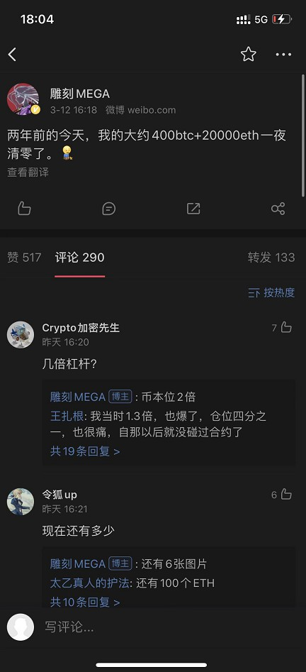
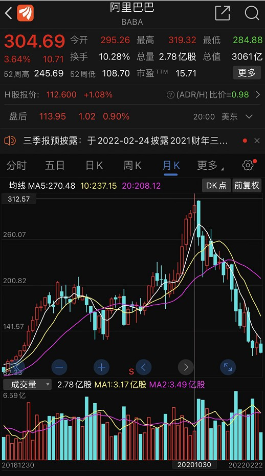
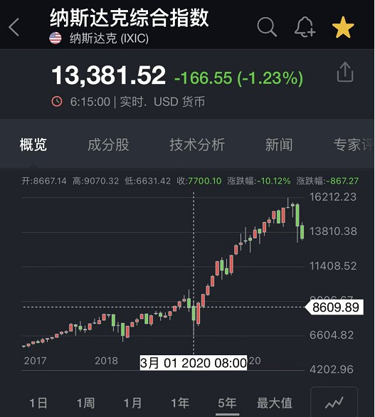
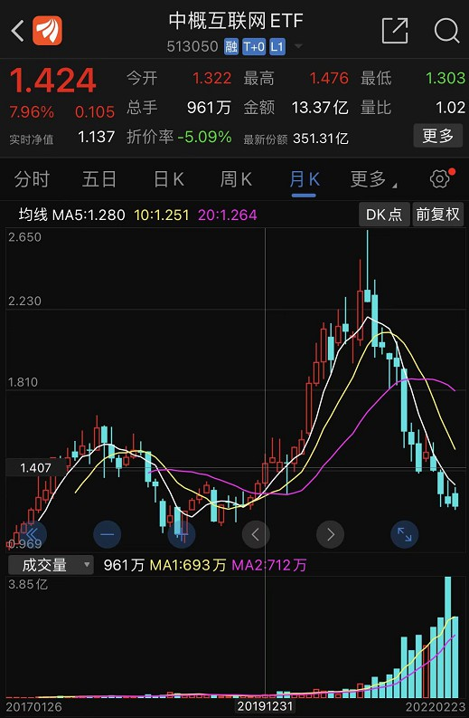
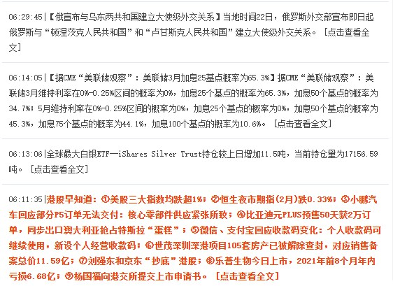
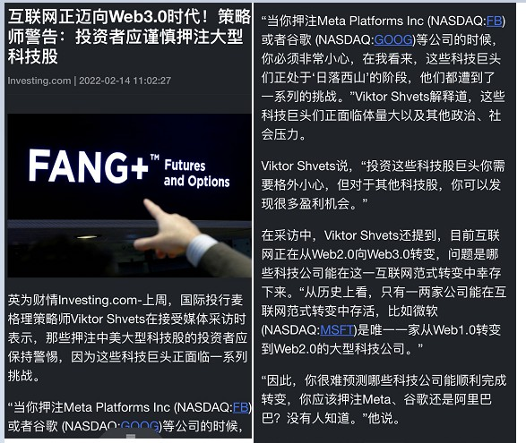

# (某码农的不科学)投机市场观察录
#### [2022-3-19] [基本常识] 为什么美债会影响全球资产价格？
- 借贷利率会互相参考，具有传导性。
```java
    逻辑：
    
    美债由国家背书/信用好/无风险.
        |
    信用好代表着,使美债收益率偏低也不愁卖.
        |
    其他借贷品种要比美债收益高才有人买,不得不参考美债收益率.
        |
    美债间接影响了借贷市场利率,美债收益率成为全球资产定价之锚.
        |
    美国人如果能操控美债收益率，就能影响全球其他资产价格.
```
<br>

#### [2022-3-19] [基本常识] 美国人如何操控美债收益率？
- 公开市场操作(open market operation)<br>
即亲自参与市场交易，而非强制命令。<br>
中央银行到二级市场买卖债券，影响供需关系，改变债券价格。<br>
```java
    逻辑：
    
    美债价格与美债收益率负相关，当美债价格上升，美债收益率下降.
        |
    中央银行可以参与二级市场的美债交易.
        |
    中央银行在二级市场买入美债，减少了市场上美债的供需，提高了美债价格.
        |
    美债价格上升，美债收益率下降.
        |
    影响全球资产价格.
```
- 改变银行储备金率
- 优惠利率(prime credit rate)
<br>

#### [2022-3-15] [市场观察] 中概互联的价值重估
(不局限于中概互联，范围扩展可能是所有中国核心资产)  
(1)第一层BUFF：美元流动性收紧,引发的估值泡沫破裂  
(2)第二层BUFF：互联网产业周期寡头阶段行情  
(3)第三层BUFF：反垄断、共同富裕目标、互联网基础设施公共服务化趋势  
(4)第四层BUFF：逆全球化趋势,中美重演俄乌金融封锁的预期,引发外资不计成本的抛售中国资产  

第一层BUFF：美元流动性收紧,引发的估值泡沫破裂  
根据美元指数和港股指数负相关的常识，对比它们的趋势可以显而易见的观察到流动性的变化。  
  
.  
中丐互联科技公司的股价几乎都是2020 3月吹泡泡吹起来的。
  
.  
第二层BUFF：互联网产业周期寡头阶段行情  
参考工业革命成熟期的走势  
  
.  
第三层BUFF：反垄断、共同富裕目标、互联网基础设施公共服务化趋势,重塑估值方式  
"如果只是一个政策的冲击，  
你冲击的可能是对盈利的判断，  
但这个还都在正常的逻辑下，  
但是如果你的整个商业模式都发生重大的变化了，  
那你可能甚至是说，  
整个商业模式在中国的政策目标里未来都转向一个公共服务类，  
甚至带有一定这个这个公益性质的行业的话，  
那这可不是一个简单的光盈利预期下修的问题."  ----来自付总  
.  
第四层BUFF：逆全球化趋势,中美重演俄乌金融封锁的预期,引发外资不计成本的抛售中国资产  
  
为什么在2022年3月这个时间点通过"中概下市法案"？  
猜测：为了驱赶欧洲资本逃出欧洲，同时不能流向中国，保障回流到美国国内。

.  
.  
#### [2022-3-15] [市场观察] 回忆312币圈纪念日  
以下是312暴跌的逻辑和发生经过（按照时间顺序和逻辑关系如下):  
疫情、全球股市、经济危机、流动性恐慌等宏观情绪传染到币圈，引发2月中旬到3月上旬的下跌调整。   
减半一致性预期被击溃，且比特币避险属性共识开始瓦解，市场负预期严重。   
.  
巨鲸出货卖盘增加。 引发下跌进一步下跌。  
投机客、资管量化、苦命的矿工多头杠杆（包括借贷平台、场内杠杆现货、Defi去中心化借贷）自我叠加式爆仓，  
价格快速进入自我加强的下跌 价格下跌如此之快，  
乃至BitMEX上的套利党爆仓导致互相踩踏，  
进一步加速下跌，价格如同自由落体一般。  
.   
Btc拥堵充值不进去、搬砖口子小引发的USDT溢价过高一起共同导致了场外入金严重不足。  
场外入金难以抵挡场内的爆仓螺旋，价格颓势难以抵挡。   
Maker的eth抛压，造成了价格进一步下跌。  
并且，赎回dai进一步造成了流动性枯竭。   
.  
圈外空军见到这个情况，如同嗅到了猎物，也加入做空行列，价格接着下探。  
直至Bitmex拔了网线，市场上的最大卖盘瞬间停止，场外流动性开始跟上，  
且Bitmex用自己的保险金吃爆仓单，一下子稳住了市场，开始反弹。  
.  
Bitmex冷不丁把吃的爆仓单投入市场，且小心翼翼避免价格再度被砸下去，盘面开始平稳。  
至此3月15日，无数媒体开始散步悲观信息，以至于币价处于低位而人心惶恐，一时间加密资产信心受到重创。  
.  
  
.  
1.3倍低杠杆爆仓的行情历历在目:   
  
  
.  
.  
#### [2022-2-23] [状态记录] 记录美指、纳斯达克、中概互联、阿里巴巴
时代背景版：  
1 距离新冠病毒流行传播两年后。<br> 
2 全球大放水资产价格全面暴涨结束后。<br> 
3 美联储2022-3月加息预期前，北约逼宫俄罗斯地缘冲突加剧，美元回归美国国内，美指趋势走强，全球流动性收紧。<br> 
4 中国反垄断打压互联网巨头一年后,以阿里巴巴为代表的中概互联指数回撤50%-60%后。<br> 
5 芒格2021首次抄底阿里巴巴后回撤40%+，2022依然加仓阿里。<br> 
  
  
  
  
  
  
  
  
  
.  
.  
#### [2022-2-16] [市场观察] 恒大危机
最大的风险永远来自，对长期现金流的乐观预期，对人为背书刚性兑付承诺的盲目信任。  
在行业状态顶峰时期或临近拐点事情，做出大发幅度动作，  
典型如：  
加大投资数目大胆扩张规模，刷信用卡凑首付、拉满30年贷款买房。  
体现了对长期稳定收入、稳定增长的乐观预期。  
[许家印不想贱卖资产 恒大员工却只能卖自住房](./data/2022-2-16-2.txt)  
.  
.  
#### [2022-2-16] [市场观察] 记录于FB股价腰斩后
我理解,元宇宙最大的变数来自政治正确。  
哪种政治正确？  
对科技巨头数据垄断行为的反对和声讨，用户对数据和隐私去中心化的汹涌浪潮。  
.  
对于互联网去中心化改造的可行性，WEB 3.0的实施，还没有一个明确的解决方案，  
但这并不影响民众对科技巨头的讨伐声浪，对中心化与WEB 3.0更多的变成一种二元对立，一种立场和口号。  
.  
什么是政治正确？政治正确是非理性的，不讲效率和成本，甚至是傻逼的共识，  
但傻逼的共识也是共识，它将成为多方利益博弈的筹码，最终反应到行政决策和市场价格。


