# (某码农的不科学)投机市场观察录 
## [2022-5-23] [市场观察] 长文阅读整理<<经济回报、利率、汇率、资产和负债 价值和估值(资本流动模型)>>

原文：<br>
[经济回报、利率、汇率、资产和负债 价值和估值](./data/readme/2022-5-23-1.7z)<br>

###### 情况1<br>
美联储加息阶段, A国增长>美国增长<br>
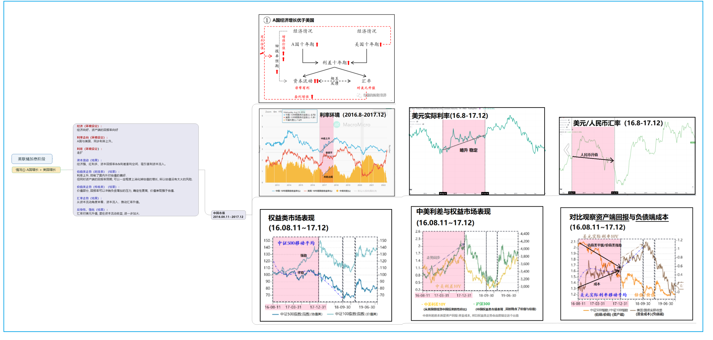
<br><br>

###### 情况2<br>
美联储加息阶段, A国增长<美国增长<br>
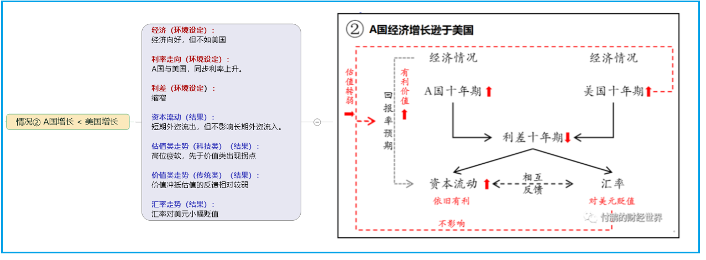
<br><br>

###### 情况3<br>
美联储加息阶段, A国经济下行<br>

<br><br>


## [2022-4-22] [市场观察] 从负债端看资产回报率
#### 观点来自东北证券-付鹏
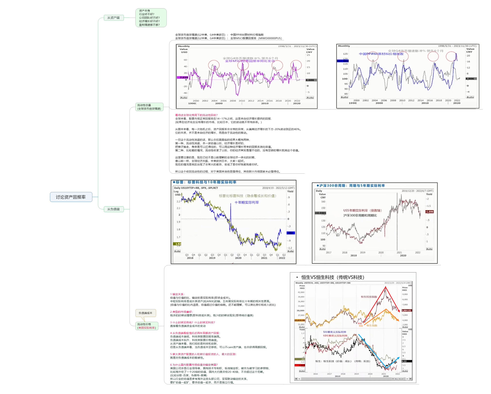
<br><br>

#### 全球主要货币信贷增速 <--> PPIRM、MSCI全球股指
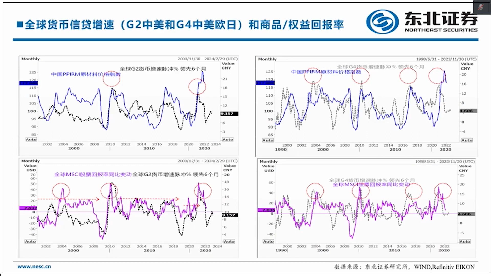
<br><br>

#### 流动性视角,解读中美利差的本质
```java
1 中债理解成投机标的，即资产回报。
2 美债收益率理解成名义利率，借钱去其他投机市场炒作的成本，即负债端。
3 从这个资产负债的视角来看，中美利差的本质，即资产回报:负债端成本 (理解成两者比值)
4 如此就可解释，为什么投机市场走势、各市场指数，会高度关联或者说锚定中美利差。
```
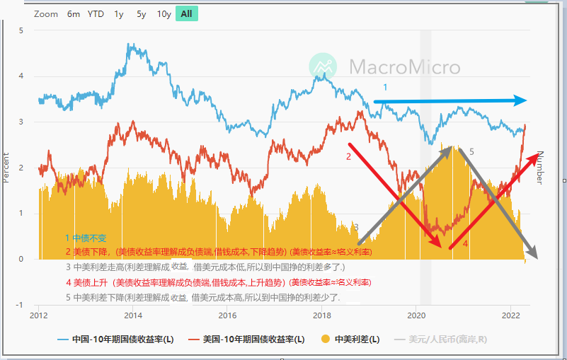<br>
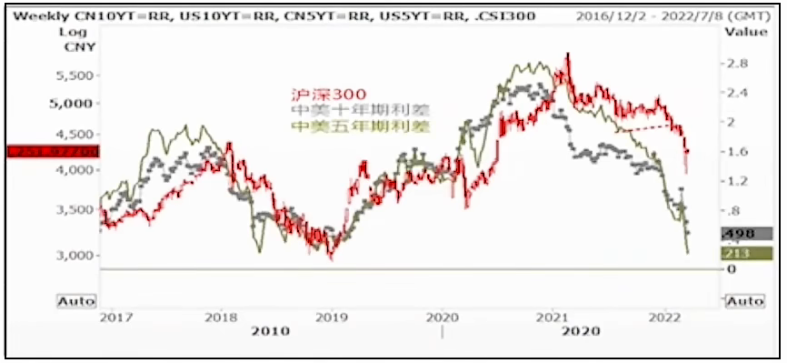
<br><br>

#### 流动性视角,解读长短期美债收益率倒挂的本质
```java
在2016年以后，
长端美债代表全球(包括中国 欧洲在内国家,弱势的经济增长和回报)
短端美债代表美国(仅仅代表当前强势复苏的美国)
所以长短端美债倒挂和中美利差倒挂，性质上是一回事，
美国可以承受强势加息，在加息中复苏，而其他国家承压放缓增长。
反映在资产上是新兴国家股市崩溃，反映在汇率上是新兴市场国家货币大幅度贬值。
```
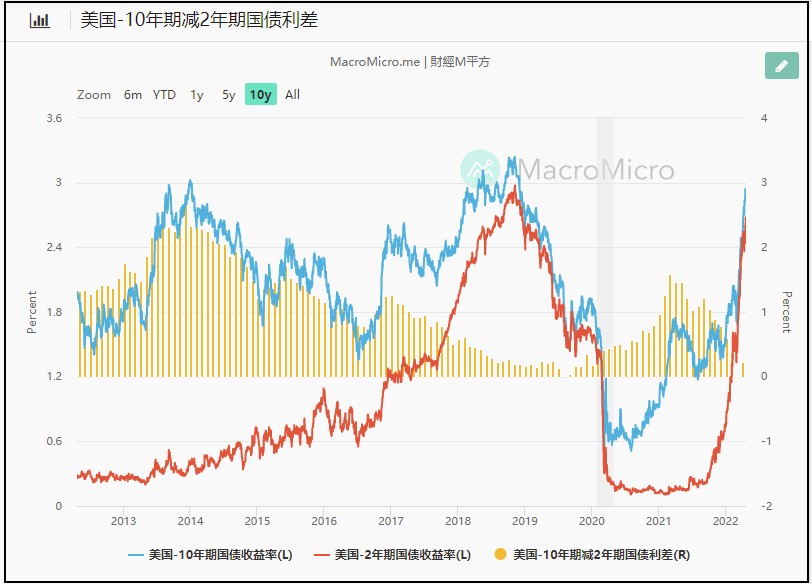
<br><br>

## [2022-3-22] [市场观察] 为什么加密原住民在这一轮周期要重点观察美股？
因为加密市场参与者的结构发生了变化,<br>
和以往的参与者类型不同，<br>
这一轮涌入了大批的美股大玩家(同时还驱逐了大量的中国散户)，<br>
美股玩家会用他们的逻辑给大饼定价，<br>
他们的交易习惯和资金使用特点，<br>
会深刻的影响大饼的中短期走势。<br>
(进而影响左侧人群的抄底时机)<br>
<br>
**参考：科技股特斯拉走势vs大饼走势** <br>
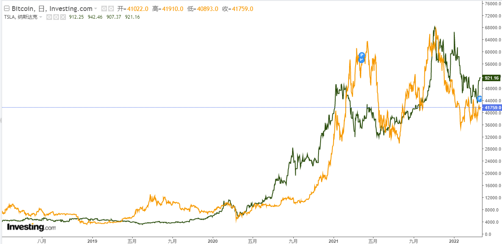  
<br>
**为什么呈现出美股化的趋势？**<br>
我理解，美股玩家用他们"现金流贴现法"类似的习惯给大饼定价(**贴现率的变化会引起大饼价格波动**),把大饼当成一种科技股来买卖,并且通过他们近两年低廉的资金成本(一系列放水所致)，暂时掌控了定价。
<br><br>
**我们关心什么？**<br>
如果之前大饼和特斯拉走势相似，那缩表+加息的牌全部打出，<br>
按照现金流贴现的逻辑科技股跌，大饼跟着一起跌吗？<br>
在一两年之间，还能继续刻舟求剑吗？走出自己以往的节奏吗？<br>
<br><br>

## [2022-3-22] [市场观察] 经济衰退红灯，长短期美国国债收益率即将倒挂
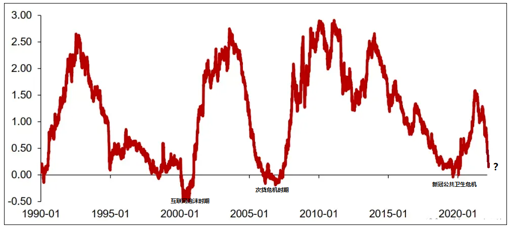  
<br>

**正常情况**：时间越长利息越高  
十年期美债收益率 > 两年期美债收益率
<br>

**异常情况**：("美债收益率倒挂"现象)  
十年期美债收益率 < 两年期美债收益率
<br>

**差值**：  
差值=十年收益率-两年收益率  
差值<0时，常常是美国经济衰退时期.
<br>

**划重点**：<br>
我们关心什么？<br>
更多的是,市场大概处于一个什么位置,一个大致的拐点区间.<br>
类似巴菲特之类的老油条最擅长,手握天量现金，平常没有多余的动作，等崩溃时来一发.<br>
(三五年内就那么一次好机会,最多能精确到某年上半年还是下半年的样子,能从2021憋到现在,其实也能超过很多人了)<br>
<br><br>

## [2022-3-15] [市场观察] 中概互联的价值重估
(不局限于中概互联，范围扩展可能是所有中国核心资产)  
(1)第一层BUFF：美元流动性收紧,引发的估值泡沫破裂  
(2)第二层BUFF：互联网产业周期寡头阶段行情  
(3)第三层BUFF：反垄断、共同富裕目标、互联网基础设施公共服务化趋势  
(4)第四层BUFF：逆全球化趋势,中美重演俄乌金融封锁的预期,引发外资不计成本的抛售中国资产  

第一层BUFF：美元流动性收紧,引发的估值泡沫破裂  
根据美元指数和港股指数负相关的常识，对比它们的趋势可以显而易见的观察到流动性的变化。  
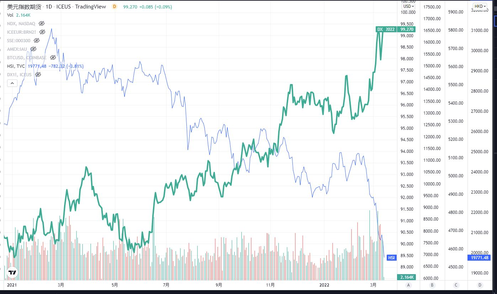  
(美元指数vs港股大盘)  
<br>
中丐互联科技公司的股价几乎都是2020 3月吹泡泡吹起来的。  
  
(美元指数vs中概互联指数基金)  
<br>
第二层BUFF：互联网产业周期寡头阶段行情  
参考工业革命成熟期的走势  
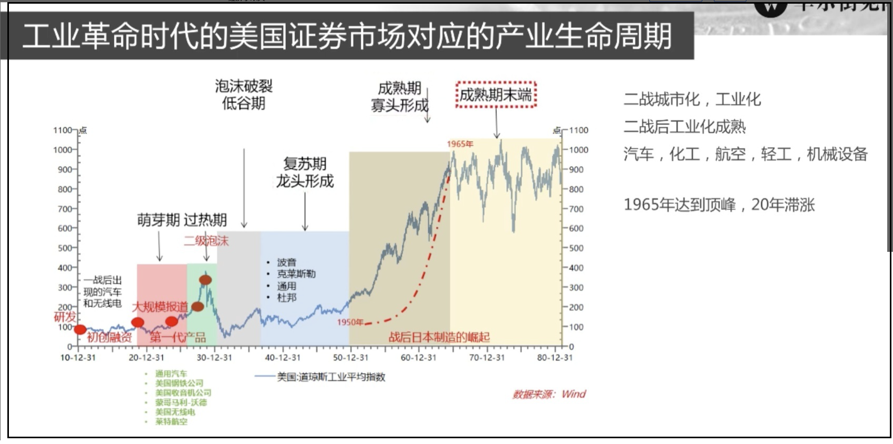  
<br>
第三层BUFF：反垄断、共同富裕目标、互联网基础设施公共服务化趋势,重塑估值方式  
"如果只是一个政策的冲击，  
你冲击的可能是对盈利的判断，  
但这个还都在正常的逻辑下，  
但是如果你的整个商业模式都发生重大的变化了，  
那你可能甚至是说，  
整个商业模式在中国的政策目标里未来都转向一个公共服务类，  
甚至带有一定这个这个公益性质的行业的话，  
那这可不是一个简单的光盈利预期下修的问题."  ----来自付总  
<br>
第四层BUFF：逆全球化趋势,中美重演俄乌金融封锁的预期,引发外资不计成本的抛售中国资产  
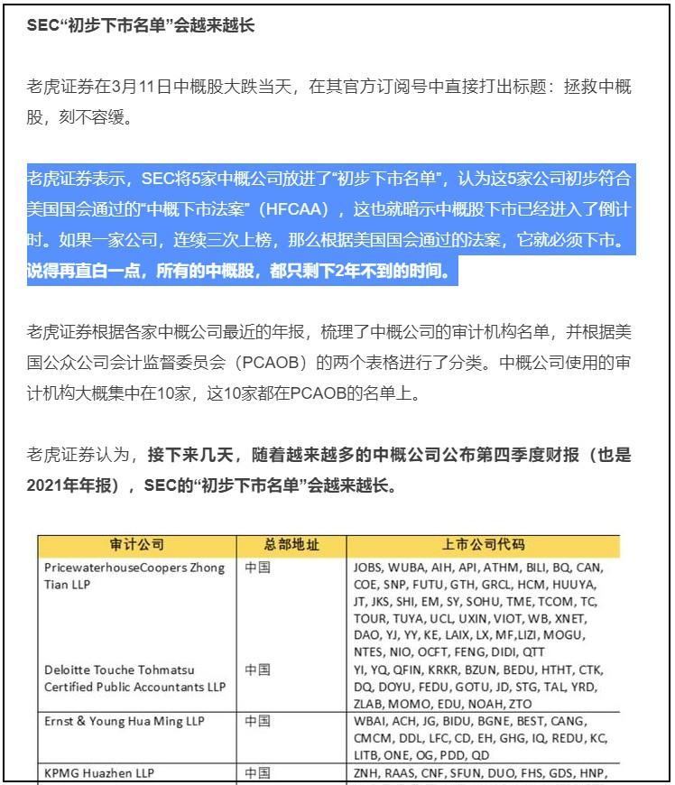  
为什么在2022年3月这个时间点通过"中概下市法案"？  
猜测：为了驱赶欧洲资本逃出欧洲，同时不能流向中国，保障回流到美国国内。
<br><br>

## [2022-3-15] [市场观察] 回忆312币圈纪念日  
以下是312暴跌的逻辑和发生经过（按照时间顺序和逻辑关系如下):  
疫情、全球股市、经济危机、流动性恐慌等宏观情绪传染到币圈，引发2月中旬到3月上旬的下跌调整。   
减半一致性预期被击溃，且比特币避险属性共识开始瓦解，市场负预期严重。   
<br>
巨鲸出货卖盘增加。 引发下跌进一步下跌。  
投机客、资管量化、苦命的矿工多头杠杆（包括借贷平台、场内杠杆现货、Defi去中心化借贷）自我叠加式爆仓，  
价格快速进入自我加强的下跌 价格下跌如此之快，  
乃至BitMEX上的套利党爆仓导致互相踩踏，  
进一步加速下跌，价格如同自由落体一般。  
<br>
Btc拥堵充值不进去、搬砖口子小引发的USDT溢价过高一起共同导致了场外入金严重不足。  
场外入金难以抵挡场内的爆仓螺旋，价格颓势难以抵挡。   
Maker的eth抛压，造成了价格进一步下跌。  
并且，赎回dai进一步造成了流动性枯竭。   
<br>
圈外空军见到这个情况，如同嗅到了猎物，也加入做空行列，价格接着下探。  
直至Bitmex拔了网线，市场上的最大卖盘瞬间停止，场外流动性开始跟上，  
且Bitmex用自己的保险金吃爆仓单，一下子稳住了市场，开始反弹。  
<br>
Bitmex冷不丁把吃的爆仓单投入市场，且小心翼翼避免价格再度被砸下去，盘面开始平稳。  
至此3月15日，无数媒体开始散步悲观信息，以至于币价处于低位而人心惶恐，一时间加密资产信心受到重创。  
<br>
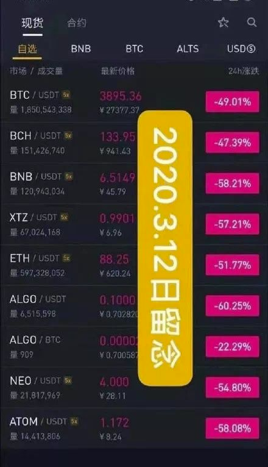  
<br>
1.3倍低杠杆爆仓的行情历历在目:   
  
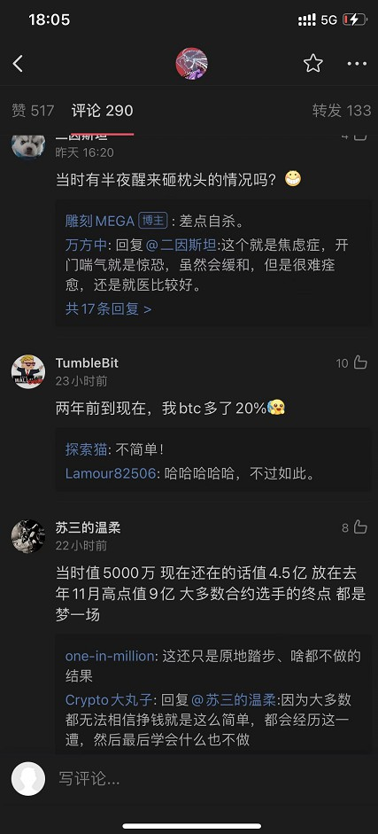  
<br><br>

## [2022-2-23] [状态记录] 记录美指、纳斯达克、中概互联、阿里巴巴
时代背景版：  
1 距离新冠病毒流行传播两年后。<br> 
2 全球大放水资产价格全面暴涨结束后。<br> 
3 美联储2022-3月加息预期前，北约逼宫俄罗斯地缘冲突加剧，美元回归美国国内，美指趋势走强，全球流动性收紧。<br> 
4 中国反垄断打压互联网巨头一年后,以阿里巴巴为代表的中概互联指数回撤50%-60%后。<br> 
5 芒格2021首次抄底阿里巴巴后回撤40%+，2022依然加仓阿里，桥水基金达里欧加仓阿里巴巴。<br> 
  
  
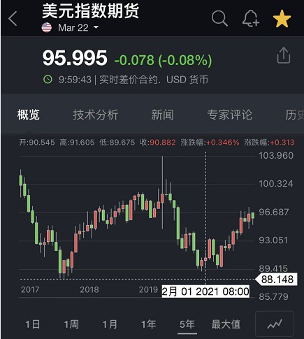  
  
  
  
  
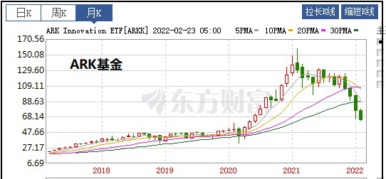  
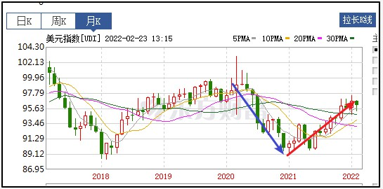  
<br>

## [2022-2-16] [市场观察] 恒大危机启示
- 最大的风险<br>
最大的风险永远来自，对长期现金流的乐观预期，对人为背书刚性兑付承诺的盲目信任。<br>
在行业状态顶峰时期，或临近拐点，仍然做出大发幅度动作。<br>
  
- 典型案例：<br>
拐点时期加大投资数目，大胆扩张规模，刷信用卡凑首付、拉满30年贷款买房，<br>
体现了对长期稳定收入、稳定增长的乐观预期，而这个预期是一种毁灭性的错误。<br>
[许家印不想贱卖资产 恒大员工却只能卖自住房](./data/readme/2022-2-16-2.txt)  
<br>

## [2022-2-16] [市场观察] 记录于FB股价腰斩后
我理解,元宇宙最大的变数来自政治正确。  
哪种政治正确？  
对科技巨头数据垄断行为的反对和声讨，用户对数据和隐私去中心化的汹涌浪潮。  
.  
对于互联网去中心化改造的可行性，WEB 3.0的实施，还没有一个明确的解决方案，  
但这并不影响民众对科技巨头的讨伐声浪，对中心化与WEB 3.0更多的变成一种二元对立，一种立场和口号。  
.  
什么是政治正确？政治正确是非理性的，不讲效率和成本，甚至是傻逼的共识，  
但傻逼的共识也是共识，它将成为多方利益博弈的筹码，最终反应到行政决策和市场价格。


